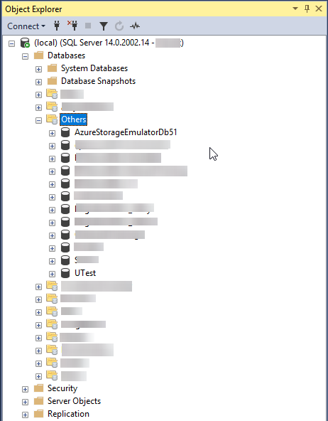

# SSMS-DatabaseFolders
An add-in for SSMS that can group databases in Object Explorer Tree.

The code is much inspired by https://github.com/nicholas-ross/SSMS-Schema-Folders, and in fact, some of the code was copied from this repo to make the function works :). In the end, it is all open source for every one to use, so feel free to add comment if you have.

The first version is only tested on SSMS 2017, other SSMS versions might or might not work.

## Install
Download latest release file from https://github.com/chrno1209/SSMS-DatabaseFolders/releases

Extract content of zip file to:
- SSMS 2017: `C:\Program Files (x86)\Microsoft SQL Server\140\Tools\Binn\ManagementStudio\Extensions`

## Options
You can configure options via `Tools > Database Folder Options...` menu.

After any changes, try to refresh Databases node in Object Explorer to see result.

## Known Issues
### Load error
If you run SSMS first time with the extension and see an error message, click No and restart SSMS. The 2rd time running will set registry setting and the extension will run normally, otherwise you can try to run SkipLoading.2017.reg and restart SSMS again.
